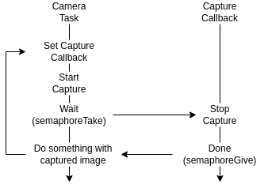

## APP Bootstrap

- Fonction main

  - initialiser bsp avec `pi_bsp_init`
  - Set fréquence/voltage si nécessaire
  - appeler votre fonction d'init à l'aide de `pmsis_kickoff(func);`

- fonction d'init

  - init CPX à l'aide de `cpxInit()`

  - activer les fonction cpx (qui nécessitent une queue comme **CPX_F_WIFI_CTRL**) à l'aide de `cpxEnableFunction(FUNC)`. Cela permet de créer une queue afin de recevoir des paquets propre à une fonction donnée.

  - Attendre un certain délai afin de s'assurer que le drone ait le temps de boot correctement à l'aide de `vTaskDelay(2000);`

  - Possibilité de faire différentes initalisations

  - initialiser les tasks qui pourront être bloquante

  - finir par une boucle infinie 

    ``` c
    while(1) {
        pi_yield();
    }
    ```

  - Pour le bon fonctionnement des différentes tasks, il est important que cette fonction rentre dans cette boucle.

**EXEMPLE: *gap_sdk/examples/gap8/basic/helloworld/helloworld.c***

## transfert UART vers stm32

- Créer un `CPXPacket_t`
- initialiser sa route à l'aide de la fonction suivante (tout se trouve dans *lib/cpx/inc/cpx.h*)
  `void cpxInitRoute(const CPXTarget_t source, const CPXTarget_t destination, const CPXFunction_t function, CPXRouting_t *route)`
  - source: GAP8
  - destination: STM32
  - function: APP
  - route: `&packet.route`
- Copier les données dans `packet.data`
- Set la taille des données dans `packet.dataLength`
- Envoyer le packet à l'aide de la fonction `cpxSendPacketBlocking(&packet)`

**EXEMPLE: *aideck-gap8-examples/examples/other/stm_gap8_cpx/stm_gap8_cpx.c***

## Task gestion wifi

Cette tâche est nécessaire afin de savoir si un PC s'est connecté au drone. Car envoyer des paquet depuis le drone sans qu'un PC soit connecter pourrait causer des erreur ou un blocage non souhaité.

- Cette Task soit être créée dans votre fonction d'init de la manière suivante : 
  ```c
  BaseType_t xTask;
  xTask = xTaskCreate(rx_wifi_task, "rx_wifi_task", configMINIMAL_STACK_SIZE * 2,
                    NULL, tskIDLE_PRIORITY + 1, NULL);
  ```

- Elle doit boucler à l'infini afin de lire des packet de fonction `CPX_F_WIFI_CTRL`

- Afin de lire des paquet en précisant sa fonction, il est nécessaire d'activer une queue pour cette fonction dans la fonction d'init de la manière suivante: `cpxEnableFunction(CPX_F_WIFI_CTRL);`

- Il est ensuite possible de lire un paquet ayant cette fonction grâce à :

  - `cpxReceivePacketBlocking(CPX_F_WIFI_CTRL, &rxp);`
  - rxp étant de type `CPXPacket_t`

- Une fois un paquet de ce type reçu, les données sont dans un format définit dans la structure `WiFiCTRLPacket_t` se trouvant dans *wifi.h* (possible de cast `rxp.data` en `WiFiCTRLPacket_t`)

- La commande dans cette structure peut correspondre à différente actions (voir enum `WiFiCTRLType` dans *wifi.h*), la cmd représentant un client se connectant au drone est `WIFI_CTRL_STATUS_CLIENT_CONNECTED` définit dans *wifi.h*

- Lorsque un paquet de ce type est reçu est que la cmd vaut `WIFI_CTRL_STATUS_CLIENT_CONNECTED` il est possible de mettre une variable global a jour (par exemple) permettant ainsi aux autres tâches de savoir si un client est connecté.

**EXEMPLE: *aideck-gap8-examples/examples/other/wifi-img-streamer/wifi-img-streamer.c***

## transfert WIFI GAP8 to PC

Afin d'envoyer de grosse données par WIFI, il est nécessaire de concevoir un petit "protocole" de communication afin d'informer combien de donnée sont transmises et de quel types il s'agit (d'une image, d'une commande ou autre) .

Voici une façon de faire:

- Toujours envoyer un header avant les données.
- Ce header va permettre d'informer combien de donnée le client connecté va devoir réceptionner.
- Dans notre cas (pour une image **RAW**) ce header peut contenir un **type** précisant qu'il s'agit d'une image, de la **width**, **height** et **profondeur** de l'image. Si l'image subit une compression alors la taille != width\*height\*depth il est donc nécessaire d'ajouter un champ **size**.
- Afin de simplifier la lecture de ce header par le récepteur, il est pratique de définir ce header comme une structure packed à l'aide de `__attribute__((packed))`. Cela permet d'éviter d'aligner les différents champs de la structure et de les mettre directement à la suite l'un de l'autre dans la mémoire. (Cela réduit aussi la taille en mémoire de la structure)
- Il est donc nécessaire d'envoyer un paquet CPX contenant comme donnée ce header avant l'image qui elle, sera split en plusieurs paquets.
- Pour envoyer un buffer conséquent, il existe la fonction `sendBufferViaCPXBlocking` se trouvant dans *wifi.h* qui s'occupe de séparer le buffer en différent paquet CPX et de les envoyer.

**EXEMPLE: *aideck-gap8-examples/examples/other/wifi-img-streamer/wifi-img-streamer.c***

## Task acquisition image de la camera

la librairie d'acquisition d'image fournie par FreeRTOS fonctionne à l'aide d'un callback voici une solution possible d'implémentation.



- Avant tout il est nécessaire d'initialiser un device correspondant à la caméra en prenant exemple sur la fonction `open_pi_camera_himax` se trouvant dans l'exemple du lab01 **wifi-img-streamer**.

- Inclure le fichier `bsp/camera/himax.h`

- Allouer puis Initialiser un buffer pouvant contenir l'image à l'aide des fonctions suivates :
  ```c
  #include "bsp/buffer.h"
  
  
  static pi_buffer_t buffer;
  ...
      imgBuff = (unsigned char *)pmsis_l2_malloc(CAM_WIDTH*CAM_HEIGHT);
      pi_buffer_init(&buffer, PI_BUFFER_TYPE_L2, imgBuff);
      pi_buffer_set_format(&buffer, CAM_WIDTH, CAM_HEIGHT, 1, PI_BUFFER_FORMAT_GRAY);
  ...
  ```

- Créer une task qui s'occupera de la capture, cette task doit :

  - Set le callback qui sera appelé lorsque la capture est terminée avec `pi_camera_capture_async`
  - démarre la capture avec `pi_camera_control(&camera, PI_CAMERA_CMD_START, 0);`
  - attendre à l'aide d'un semaphore (ou autre)
  - puis faire ses traitements/envoie de donnée sur l'image capturée.

- Le callback lui n'est responsable que de :

  - Stopper la capture à l'aide de `pi_camera_control(&camera, PI_CAMERA_CMD_STOP, 0);`
  - puis de libérer le sémaphore.

**EXEMPLE: *aideck-gap8-examples/examples/other/wifi-img-streamer/wifi-img-streamer.c***

### Semaphore binaire sur FreeRTOS

- Définition: `SemaphoreHandle_t capture_sem;`
- Initialisation: `capture_sem = xSemaphoreCreateBinary();` 
- Take (sans timeout): `xSemaphoreTake(capture_sem, portMAX_DELAY);`
- Give : `xSemaphoreGive(capture_sem);`

**EXEMPLE:**
- ***gap_sdk/rtos/freeRTOS/demos/gwt/examples/kernel/mutex/main_Mutex.c***
- ***gap_sdk/rtos/freeRTOS/demos/gwt/examples/kernel/semaphore/main_Semaphore.c***

## Lire UART sur le STM32
TODO

**EXEMPLE: crazyflie-firmware/examples/app_stm_gap8_cpx/src/
stm_gap8_cpx.c**

## Niveau de batterie sur le STM32

```c
#include "pm.h"

static logVarId_t logIdPmState;

static bool isBatLow() { return logGetInt(logIdPmState) == lowPower; }


...
  if (isBatLow()) {
    terminateTrajectoryAndLand = true;
  }
...
```
**EXEMPLE: crazyflie-firmware/examples/demos/swarm_demo/app.c**

## Erreur possible
Si plusieurs tâches tournent et utilise la lib CPX en même temps à des fréquences plutôt élevée, certain paquet peuvent disparaitre ?
Exemple:
- Une tâche envoie un msg en UART au STM32
- Une tâche envoie une img en wifi a un CLIENT
- Certain paquets devant aller au CLIENT disparaissent
- **Solution:**
	- **dans le ficher cpx.c entourer le contenu de la fonction cpxSendPacketBlocking par un semaphore binaire (mutex).**
